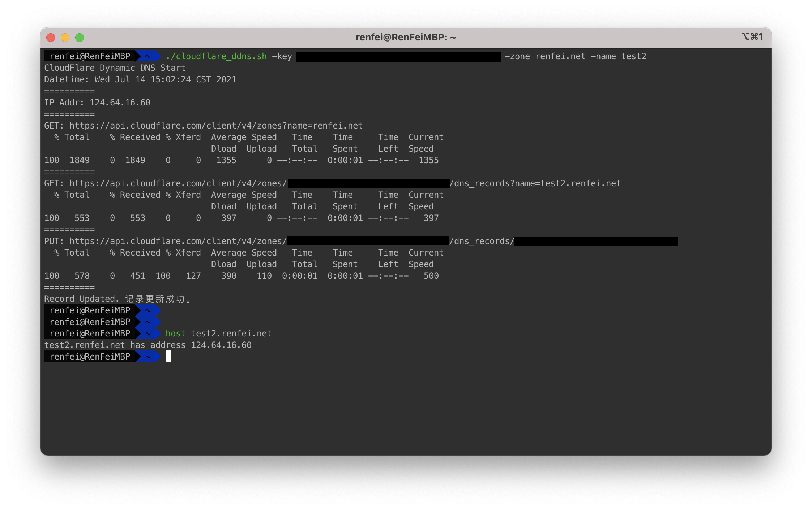

[English](./README.md) | [简体中文](./README_ZH.md)


Note: the copyright of cloudflare® graphic trademark belongs to cloudflare, Inc.

# Cloudflare Dynamic DNS
Dynamic DNS Shell script based on CloudFlare API v4. 

## Parameter Description

The selected parameters are mandatory parameters:

- [x] -key: Cloudflare API Authorization Key, interface Token, application address: [https://dash.cloudflare.com/profile/api-tokens](https://dash.cloudflare.com/profile/api-tokens)
- [x] -zone: domain, for example: renfei.net
- [ ] -zone_id: The unique ID of the domain name on Cloudflare
- [ ] -type: Domain name record type, for example: A record
- [ ] -rec_id: The unique ID of the domain name record
- [x] -name: Second-level domain name such as www
- [ ] -content: request body content
- [ ] -ttl: Parsing record survival time, 1 is automatic
- [ ] -proxied: Whether to enable CloudFlare proxy


## Example

Domain name: test2.renfei.net, first go to Cloudflare to add domain name A record resolution, and manually execute it once:

```bash
bash /path/to/cloudflare_ddns.sh -key 404613183ab3971a2118ae5bf03d63e032f9e -zone renfei.net -name test2
```


### Executed by Linux cron timing task

```bash
crontab -e
0 */1 * * * ? /path/to/cloudflare_ddns.sh -key 404613183ab3971a2118ae5bf03d63e032f9e -zone renfei.net -name test2 >> /path/to/cloudflare_ddns.log
```